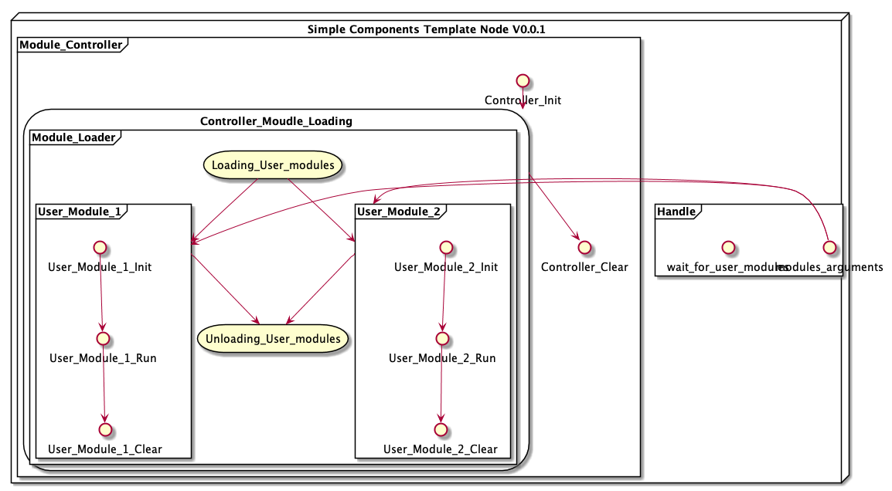

# SimpleComponentTemplate

SimpleModuleTemplate(SMT) is template for module based programming(C++ 11).

## Overview

### System Diagram

## 3th Party library

- [spdlogger](https://github.com/gabime/spdlog)  v1.4.2
- [nlohmann/json](https://nlohmann.github.io/json/) v3.7.3